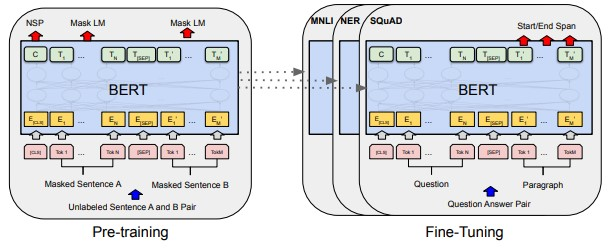

## BERT: Pre-training of Deep Bidirectional Transformers for Language Understanding

### Jacob Devlin Ming-Wei Chang Kenton Lee Kristina Toutanova
### Google AI Language

# Abstract

BERT 는 새로운 언어 표현 모델입니다. 기존의 representation models(Peters et al., 2018a; Radford et al., 2018)과는 다르게 BERT는 모든 계층의 왼쪽 및 오른쪽 컨텍스트에서 공동으로 조건화함으로써 레이블이 없는 텍스트에서 심층 bidirectional 표현을 사전 학습하도록 설계되었다. BERT는 한개의 추가 출력 계층으로 미세하게 조정되어 작업 아키텍쳐 수정 없이 답장, 추론과 같은 작업에 대한 최신 모델을 생성한다.
BERT는 강력한 성능을 자랑하는데, 11개의 자연어 처리에서 최고의 결과를 얻을 수 있다. GLUE 점수를 80.5%, MultiNLI 정확도를 86.7%로 높이는 작업을 포함한다. SQuAD v1.1 문항은 93.2로, SQuAD v2.0 시험 F1은 83.1이다.

# 1. introduce

- BERT는 문장 수준 및 토큰 수준 작업의 대규모 제품군에서 최첨단 성능을 달성하여 많은 작업별 아키텍처를 능가하는 최초의 미세 조정 기반 표현 모델이다.
- BERT는 11개의 NLP 작업에 대한 최첨단 기술을 발전시킨다.

# 2. Related Work

#### 2.1 Unsupervised Feature-based Approaches
- Pre-trained word 임베딩은 현대 NLP 시스템의 필수적인 부분으로, 처음부터 학습한 임베딩보다 상당한 개선을 제공한다.

#### 2.2 Unsupervised Fine-tuning Approaches
- Unsupervised Feature-based Approaches와 마찬가지로 레이블이 없는 상태에서 사전 훈련된 단어 임베딩 매개 변수만 수행한다.

figure1 -  전반적인 Pre-training 과 Fine-tuning 절차이다. 출력 계층을 제외하고, 사전 훈련과 미세 조정 모두에서 동일한 아키텍처가 사용된다.
동일한 사전 훈련된 모델 매개 변수는 다양한 down-stream 작업에 대한 모델 초기화 하는데에 사용된다. fine-tuning 중에는 모든 파라미터가 fine-tuning된다.
[CLS]는 모든 입력 예제 앞에 추가된 특수 기호이고 [SEP]는 특수 구분 기호이다.

# 3. BERT
 프레임 워크에는 Pre-training, fine-tuning 두가지 단계가 있다. Pre-training 동안 모델은 서로 다른 사전 훈련 작업에 대해 레이블이 지정되지 않은 데이터에
훈련한다. Fine-tuning을 위해 BERT 모델은 먼저 Pre-taining을 진행한 매개 변수로 초기화 되고 모든 매개 변수는 Down-stream 작업의 레이블이 지정된 데이터를 
사용하여 Fine-tuning된다. 각 다운스트림 작업에는 Pre-taining된 동일한 매개 변수로 초기화되었음에도 불구하고 별도의 Fine-tuning된 모델이 있다. 그림 1의 질문 답변 
예제는 이 섹션의 실행 예제로 사용된다.

#### 3.1 Pre-training BERT

Masked LM :  불행하게도, 표준 조건부 언어 모델은 왼쪽에서 오른쪽으로 또는 오른쪽에서 왼쪽으로만 훈련될 수 있는데, bidirectional 조건화는 각 단어가 간접적으로 "자신을 볼 수 있게" 할 수 있고,
모델은 다중 계층 맥락에서 대상 단어를 사소한 것으로 예측할 수 있기 때문이다. 심층 bidirectional 표현을 훈련하기 위해 입력 토큰의 일부 비율을 무작위로 마스크한 다음 마스크된 토큰을 예측합니다.
마스크 토큰에 해당하는 hidden vectors는 표준 LM(language Model)에서와 같이 어휘를 통해 softmax 함수로 출력된다. denoising auto-encoders(Vincent et al., 2008)와 달리, 우리는 전체 입력을 
재구성하지 않고 마스크된 단어만 예측한다.
 이를 통해 bidirectional Pre-trained model 을 얻을 수 있지만, [MASK] 토큰이 fine-tuning 중에 나타나지 않기 때문에 pre-training 과 fine-tuning에 불일치를 만들고 있다는 단점이 있다.

#### 3.2 Next Sentence Prediction (NSP)

질의응답(QA)과 자연어 추론(NLI)과 같은 많은 중요한 다운스트림 작업은 언어 모델링에 의해 직접 포착되지 않는 두 문장 사이의 관계를 이해하는 것을 기반으로 한다.
문장 관계를 이해하는 모델을 훈련하기 위해, 우리는 단일 언어 말뭉치에서 일반적이게 생성할 수 있는 이진화된 다음 문장 예측 작업을 위해 사전 훈련한다.
섹션 5.1에서 이 작업에 대한 사전 훈련이 QA와 NLI 모두에 매우 유익하다는 것을 보여준다.

